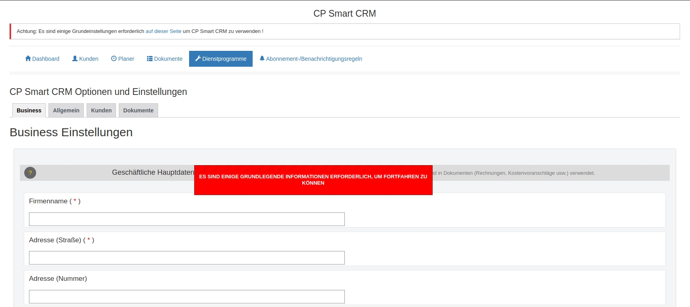
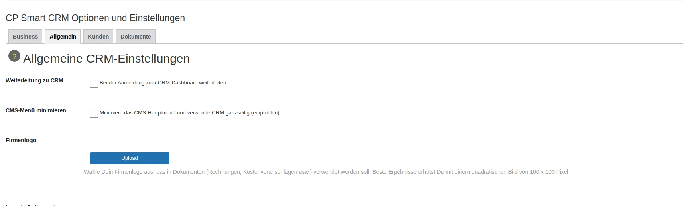

<h2 align="center" style="color:#38c2bb;">📚 CP Smart CRM</h2>

  <a href="https://github.com/cp-psource/cp-smart-crm/discussions" style="color:#38c2bb;">💬 Forum</a>
  <a href="dokumentation.html" style="color:#38c2bb;">📝 Dokumentation</a>
  <a href="https://github.com/cp-psource/cp-smart-crm/releases" style="color:#38c2bb;">📝 Download</a>

## 1. Grundeinstellungen

Nach der Aktivierung des Plugins siehst Du eine Benachrichtigung, in der Du einige grundlegende Daten eingeben musst, um das Managementsystem zu verwenden, bis dahin ist die Navigation zwischen den verschiedenen Abschnitten blockiert.

## 2. CP Smart CRM-Optionen

Im Menü "DIENSTPROGRAMME"->Einstellungen findest Du als ersten Punkt des Untermenüs die Konfigurationseinstellungen des Managementsystems, die in Abschnitte unterteilt sind:

### Dokument-Einstellungen

**Einrichtung von Dokumenten**

**GRUNDLEGENDER MEHRWERTSTEUERSATZ**
Die Standardeinstellung des Mehrwertsteuersatzes. Es ist möglich, den Wert der Mehrwertsteuer in den einzelnen Zeilen der ausgestellten Rechnung zu ändern.
Im Falle der Aktivierung des WP Smart CRM WOOcommerce Addon ist der Mehrwertsteuersatz derjenige, der im einzelnen Produkt festgelegt ist (der Standard-Mehrwertsteuerwert der Produkte ist in jedem Fall der in diesem Abschnitt festgelegte Wert

**NUMMERIERUNG DER DOKUMENTE**
Es ist möglich, Präfixe und Suffixe festzulegen, die der Nummerierung von Rechnungen und Kostenvoranschlägen hinzugefügt werden. Es ist auch möglich, eine anfängliche fortlaufende Zahl festzulegen, von der aus mit der Nummerierung von Rechnungen und Kostenvoranschlägen begonnen wird.
ACHTUNG: Es wird nicht empfohlen, diesen Vorgang durchzuführen, nachdem Sie bereits Rechnungen erstellt haben, da dies zu Inkonsistenzen in der Buchhaltung führen kann

**BENACHRICHTIGUNG "MAHNUNG" FÜR DIE ZAHLUNG DER RECHNUNG**
Es ist möglich, standardmäßig eine Anzahl von Tagen nach dem Fälligkeitsdatum der Rechnung festzulegen, um Benachrichtigungen zu senden. Diese Funktion ist nützlich, um Administratoren oder ausgewählte Benutzer daran zu erinnern, zu überprüfen, ob die Rechnung bezahlt wurde. Die Standardeinstellungen können pro Dokument geändert werden

settings-dokumente
Kopf des Dokuments

**AUSRICHTUNG DES DOKUMENTKOPFES**
Mit einem einfachen Drag & Drop ist es möglich, die Ausrichtung der Kopfelemente von Rechnungen und Kostenvoranschlägen zu ändern: Logo und Kopfzeile nach rechts oder links

settings-header-dokumente

**Zahlungsarten**

**DEFINITION DER ZAHLUNGSARTEN**
Zahlungsarten sind Textzeichenfolgen, die im Ausdruck der Rechnung angegeben werden (z.B. 30 Tage Überweisung, 60 Tage Kreditkarte, etc.) und bei der Erstellung von Rechnungen verwendet werden.
Wenn ihnen eine tatsächliche Anzahl von Tagen zugeordnet ist (mit dem zweiten Feld "Tage"), wird dieser Wert verwendet, um automatisch das Fälligkeitsdatum für die Zahlung der Rechnung festzulegen und die (optionalen) entsprechenden Benachrichtigungen festzulegen.

einstellungen-dokumente-zahlungsmethoden

Nachrichteneinstellung in Rechnungen/Belegen

**MELDUNGEN AUF DER RECHNUNG/DEM KOSTENVORANSCHLAG**
In diesem Abschnitt können Sie einige Standardzeichenfolgen festlegen, die beim Drucken von Rechnungen und Kostenvoranschlägen wiederholt werden sollen.
Insbesondere: das Präfix, das an den Namen des Empfängers angehängt werden soll (Liebes Zeichen, liebe Adresse...), ein Freitext, der vor dem automatisch generierten Dokument platziert werden soll, ein Text, der vor dem Dokument platziert wird. Ein Beispiel für einen "Vorher"-Text kann das klassische "Wie vereinbart senden wir unser bestes Angebot für Folgendes:" sein, während ein Beispiel für einen "Nachher"-Text lauten kann: "Wir stehen Ihnen weiterhin für alle Fragen zur Verfügung und bei dieser Gelegenheit bieten wir unsere besten Grüße an"

settings-documents-messages

## Allgemeine Einstellungen

**Die Grundkonfigurationen des CRM.**

Logo: Verwenden Sie vorzugsweise quadratische Bilder mit 100px x 100px
Alle Benachrichtigungen für Administratoren anzeigen: Site-Administratoren können die Aktivitäten aller Agenten sehen.
Manager für vergangene Aufgaben: Mit dieser Option können Sie vergangene Aufgaben (älter als einen Tag), die als "erledigt" oder "abgebrochen" markiert wurden, aus der Ansicht ausschließen
Löschen von Aktivitäten zulassen: Optional ist es möglich, das Löschen von Aktivitäten nur Administratoren oder sogar denjenigen zu erlauben, die den TODO oder TERMIN erstellt haben
Erweitert die Agentenfunktionen: ob Agenten die Dokumente und Benachrichtigungen anderer Agenten sehen können oder nicht
Legen Sie eine E-Mail-Adresse als Absender von Benachrichtigungen fest:
Legen Sie eine E-Mail-Adresse als Absender für CRM-Benachrichtigungs-E-Mails
fest. Wenn leer ist, wird die E-Mail-Adresse des Site-Administrators verwendet.
Festlegen eines Namens als Absender von Benachrichtigungen:
Legen Sie einen Namen als Absender von CRM-Benachrichtigungen fest, der als Absendername von E-Mails angezeigt wird, die an Kontakte gesendet werden. Wenn das Feld leer ist, wird der Site-Name verwendet
Höhen der Raster Stammdaten und Dokumente: Der Standardwert ist 600px, Sie können einen anderen Wert festlegen, um das Layout der Datensatzanzeige zu verbessern

## Kontakt-Einstellungen

**CLIENT-TAXONOMIEN**

Es ist möglich, Taxonomiebegriffe mit Stammdaten zu verknüpfen, um die Archivierung und statistische Berechnungen zu verbessern.
Die in diesem Abschnitt zugeordneten Begriffe stehen Ihnen beim Anlegen/Bearbeiten von Stammsätzen zur Auswahl. Es ist auch möglich zu wählen, ob die Begriffe im Stammdatenraster angezeigt werden sollen, um Suchfilter anzuwenden.
Es stehen 3 Arten von Taxonomien zur Verfügung: Kategorie (z. B. Kunden, Lieferanten), Interessen (um ein Profil eines Datensatzes zu einem oder mehreren spezifischen Interessen zu erstellen) und Herkunft (um einen möglichen Kanal zu identifizieren, aus dem der Kontakt gekommen ist). In Wirklichkeit ist die Benennung von Taxonomien rein konventionell, sie können für die Erstellung von Kontaktprofilen auf eine Weise verwendet werden, die Ihren Geschäftsanforderungen entspricht